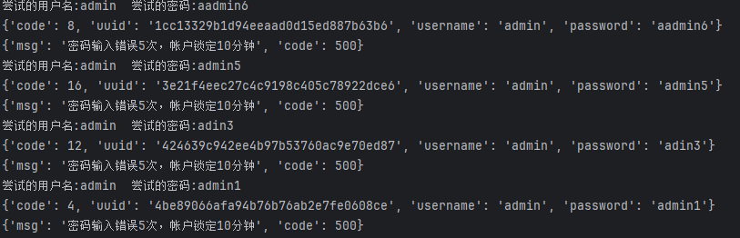
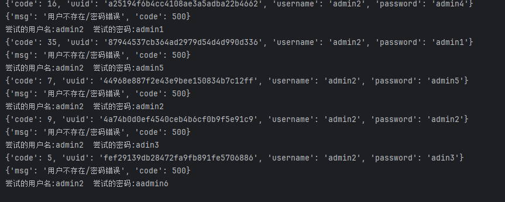

这是若依框架前端密码爆破定制开发的一个程序
仅用于合法的安全测试，一切非法行为造成严重后果的自行承担。
框架采用验证码识别加用户名遍历，来达到若依框架前端暴力破解效果，该工具集后续会更新更多针对若依框架的测试工具。

使用请根据业务需求自行更改，脚本比较简单，欢迎大家指点。
请修改:json_dat文件里的登录接口,Vf文件里的验证码获取接口
请将字典文件更名为password.txt OR username.txt
脚本基于python10+开发,推荐pycharm环境

其余小概率报错，重新运行即可,待后期继续完善。

注:若依3.8默认配置用户密码输入错误达到5次，即返回锁定账户10分钟，可以由此推断该用户名是否存在

反之则为不存在该账户
